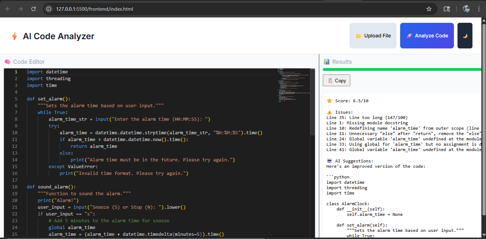
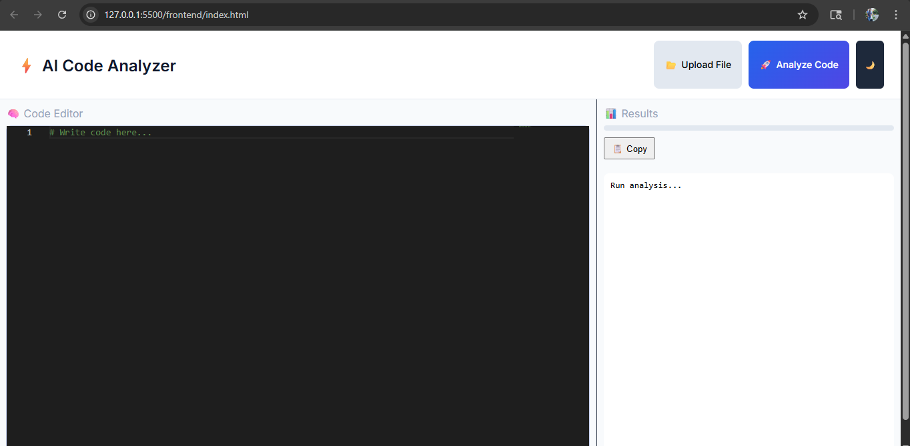

# AI Code Analyzer


🔗 **Live Demo:** https://ai-code-analyzer-shoaib.netlify.app  
📘 **API Docs:** https://ai-code-analyzer-gdt2.onrender.com/docs  

---

##  About Project

AI Code Analyzer is a full-stack web application that analyzes code quality and provides intelligent improvement suggestions.

It combines static analysis with AI assistance to help developers write cleaner and more efficient code.

---

##  Why this project?

This project acts as a lightweight code review assistant by combining:
- Static code analysis (Pylint-style logic)
- AI-based suggestions
- Real-time feedback system

---

##  Overview

This tool allows users to write or upload code and get:

- Code quality score  
- Identified issues  
- AI-powered improvement suggestions  

---

## ✨ Features

- 🧑‍💻 Interactive Monaco Editor (VS Code-like)
- 📂 File upload support
- 🤖 AI-based code analysis
- 📊 Score visualization with issue breakdown
- 🎨 Clean and responsive UI
- ⚡ FastAPI backend with structured responses

---

## 🛠 Tech Stack

### Frontend
- HTML, CSS, JavaScript
- Monaco Editor

### Backend
- Python
- FastAPI
- Uvicorn

### Deployment
- Netlify (Frontend)
- Render (Backend)

---

## 📂 Project Structure

```
ai-code-analyzer/
│
├── backend/
│   ├── main.py
│   ├── analyzer.py
│   └── requirements.txt
│
├── frontend/
│   ├── index.html
│   ├── static.css
│   └── app.js
│
├── screenshots/
│   ├── AI1.png
│   └── AI2.png
│
└── README.md
```

---

## 📸 Screenshots

### 🧑‍💻 Code Editor with Analysis Output


### 📝 Clean Editor View


---

## ⚙️ How It Works

1. User writes or uploads code  
2. Frontend sends request to `/analyze`  
3. Backend processes the code  
4. Returns score, issues, and suggestions  
5. Results are displayed instantly  

---

## 🔌 API Endpoint

**POST /analyze**

### Request
```json
{
  "code": "your code here",
  "language": "python"
}
```

### Response
```json
{
  "score": 6.5,
  "issues": [],
  "suggestions": "..."
}
```

---

## 💻 Setup (Local)

### Backend
```bash
cd backend
pip install -r requirements.txt
uvicorn main:app --host 0.0.0.0 --port 10000
```

### Frontend
Open `frontend/index.html` in browser (or use Live Server)

---

## 🧠 Notes

- CORS enabled for frontend-backend communication  
- Render free tier may cause slight delay (cold start)  
- Frontend is static and connects to deployed API  

---

## 🚀 Future Improvements

- Multi-language support  
- Improved scoring algorithm  
- User authentication system  
- Save analysis history  
- UI/UX enhancements  

---

## 👨‍💻 Author

**Shoaib Ahmad**  
🔗 https://github.com/shoaib-ahmadd  

---

## ⭐ Support

If you found this project useful, consider giving it a ⭐ on GitHub!
